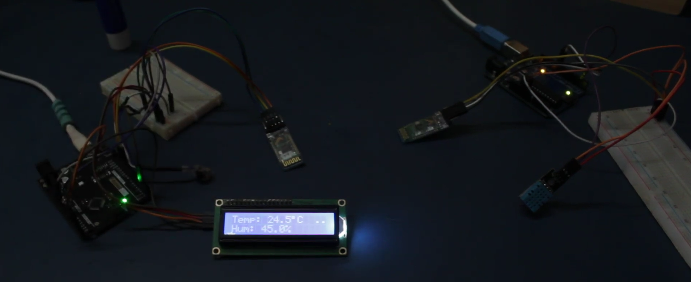
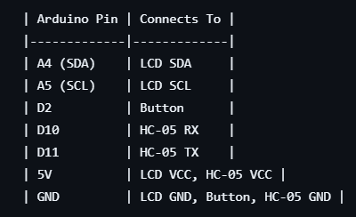

AMAN-OS 🎮
My custom operating system for Arduino Nano - 6 games, apps, wireless weather station, all controlled with ONE button!
 
 

📺 Videos
Full Demo: https://youtu.be/J0eP7VAG8SE
Weather Station: https://youtu.be/XZgUcti3Fz8

What is this?
So I wanted to see how much I could squeeze out of an Arduino Nano. Turns out - a LOT. Built an entire OS with games, apps, weather monitoring, and it all runs with a single button on a tiny LCD screen.
Spent 77 hours on this over 12 days. Worth it.
What it does
Games:

Runner (endless runner)
Snake (classic)
Reaction (speed test)
Pong (vs AI)
Memory (Simon says)
Flappy (bird clone)

Apps:

Weather (wireless DHT11 sensor)
Stopwatch
Calculator
Dice roller
Stats tracker
Settings

System stuff:

Saves high scores to EEPROM
Tracks play time
Difficulty settings per game
Boot animation (looks cool)
Screensaver
Pause menu

Hardware you need
Main system:

Arduino Nano
16x2 LCD (I2C)
One button
Optional: HC-05 Bluetooth

Weather station (optional):

Arduino Uno
DHT11 sensor
HC-05 Bluetooth
Some diodes

Wiring
Nano setup:
LCD: A4→SDA, A5→SCL
Button: D2→GND (pullup on)
Bluetooth: D10/D11 (if using)
Weather Uno:
DHT11: D2→DATA
Bluetooth: D10/D11
(Full diagrams in code comments)

How to install

Get Arduino IDE
Install LiquidCrystal_I2C library
Download this repo
Upload sketch_nov22b.ino to Nano
Done!

For weather station: upload weather_station_slave.ino to Uno
How to use
One button controls everything:

Click = navigate
Hold (1.5s) = select
Hold longer (2s) = pause

Navigate menus, play games, all with one button. It's actually pretty fun once you get used to it.

Technical stuff
Built a state machine with 18 states. Optimized LCD updates (only redraws changed chars). Stores everything in EEPROM. Runs at 40 FPS.
Weather station talks over Bluetooth - master/slave setup with binary data protocol.
Took forever to debug the timing and button debouncing but it works now.

## Images

## BOM

[View Bill of Materials (BOM)](Arduino_Projectv1.9_BOM.csv)

## Setup
1. Install Arduino IDE
2. Install libraries via Library Manager
3. Connect hardware (see wiring diagram)
4. Upload sketch_nov22b.ino to Nano
5. Upload weather_station_slave.ino to Uno (optional)
6. Pair HC-05 modules if using weather station

Known issues
Yeah there's bugs. Some games need balancing. Weather station pairing is manual. I'll fix it eventually.
Future plans

More games
Buzzer sounds
Battery indicator
Multiplayer?
OLED screen support
Better graphics

Want to help?
Fork it, fix bugs, add games, whatever. I'd love to see what you build!

Made by Aman
77 hours, 2500+ lines of code, way too much coffee
Built for Hack Club 🚢
